[English](../README.md) · [العربية](README.ar.md) · [Español](README.es.md) · [Français](README.fr.md) · [日本語](README.ja.md) · [한국어](README.ko.md) · [Tiếng Việt](README.vi.md) · [中文 (简体)](README.zh-Hans.md) · [中文（繁體）](README.zh-Hant.md) · [Deutsch](README.de.md) · [Русский](README.ru.md)

[](https://lazying.art)

# Repositorio de apuntes de las conferencias de Leonard Susskind

> Dirigido por [LazyingArt LLC](https://lazying.art). Sitios web: [lazying.art](https://lazying.art) y [learn.lazying.art](https://learn.lazying.art).

[](#)
[](#-repo-layout)
[](#-repo-layout)
[](#-repo-layout)
[](#-repo-layout)
[](#)

Este repositorio es un archivo de estudio de física centrado en las conferencias de Leonard Susskind, el ecosistema más amplio de *Theoretical Minimum* y notas complementarias derivadas de transcripciones.

Combina transcripciones de conferencias, archivos de subtítulos, notas TeX generadas, PDFs compilados y carpetas de cursos mantenidas manualmente en una estructura de directorios estable.

> 📘 Las transcripciones completas de las conferencias, los archivos de subtítulos, los flujos de trabajo de notas TeX generadas y los PDFs de cursos publicados se mantienen aquí en un solo archivo.
>
> 🛠️ La automatización de descarga, transcripción y conversión de subtítulos a notas utilizada aquí se mantiene en el repositorio de herramientas complementario [Video2Book](https://github.com/lachlanchen/Video2Book), que está incluido en este repositorio como el submódulo `Video2Book/`.

## 📚 Libros publicados

> 📷 Las portadas de vista previa se obtienen de la primera página del PDF de cada curso para que el README raíz y las tarjetas del sitio web siempre coincidan con el texto y el diseño realmente publicados.
>
> 📱 También se publican ediciones de bolsillo / penguin para los libros terminados:
> [Pocket-size 1.0x](../all_notes/pocket_books/) y [Pocket-size 1.2x](../all_notes/pocket_books_1_2x/).
> Estas compilaciones compactas están ajustadas para una lectura cómoda en dispositivos de tinta electrónica de 10 pulgadas y pantallas de clase iPad.

<table>
  <tr>
    <td colspan="4"><strong>Principal</strong> · Clásica → Cuántica → Especial → General → Estadística → Cosmología</td>
  </tr>
  <tr>
    <td align="center">
      <a href="../core_classical_mechanics/2011_fall_theoretical_minimum/classical_mechanics_theoretical_minimum.pdf">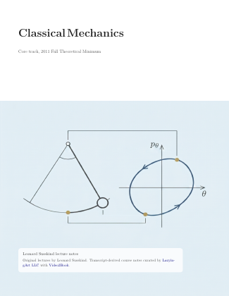</a><br>
      <strong>Mecánica clásica</strong><br>
      <sub>Otoño de 2011 Theoretical Minimum</sub>
    </td>
    <td align="center">
      <a href="../core_classical_mechanics/2011_fall_modern_physics_stanford_partial/classical_mechanics_stanford_partial.pdf">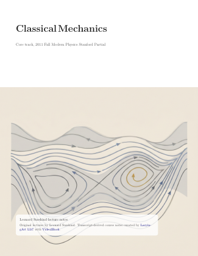</a><br>
      <strong>Mecánica clásica</strong><br>
      <sub>Ejecución parcial de Stanford</sub>
    </td>
    <td align="center">
      <a href="../core_quantum_mechanics/2012_winter_theoretical_minimum/quantum_mechanics_theoretical_minimum.pdf"></a><br>
      <strong>Mecánica cuántica</strong><br>
      <sub>Invierno de 2012 Theoretical Minimum</sub>
    </td>
    <td align="center">
      <a href="../core_quantum_mechanics/2012_winter_modern_physics_stanford/quantum_mechanics_modern_physics_stanford.pdf"></a><br>
      <strong>Mecánica cuántica</strong><br>
      <sub>Invierno de 2012 Modern Physics Stanford</sub>
    </td>
  </tr>
  <tr>
    <td align="center">
      <a href="../core_special_relativity/2012_spring_theoretical_minimum/special_relativity_theoretical_minimum.pdf">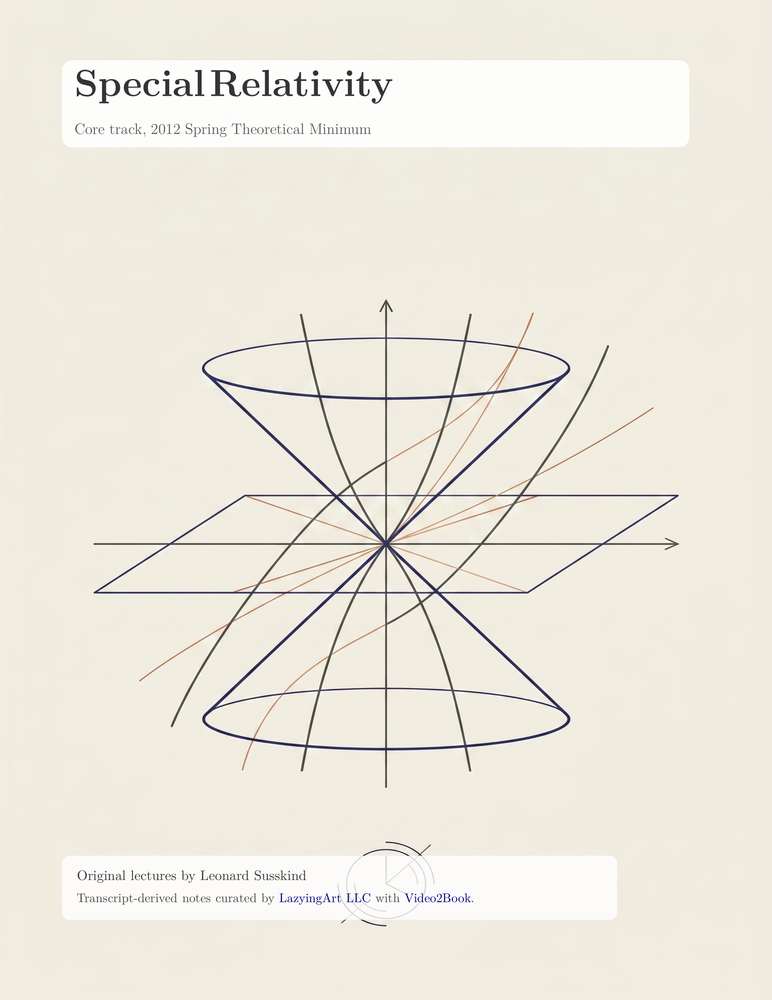</a><br>
      <strong>Relatividad especial</strong><br>
      <sub>Primavera de 2012 Theoretical Minimum</sub>
    </td>
    <td align="center">
      <a href="../core_general_relativity/2012_fall_theoretical_minimum/general_relativity_theoretical_minimum.pdf">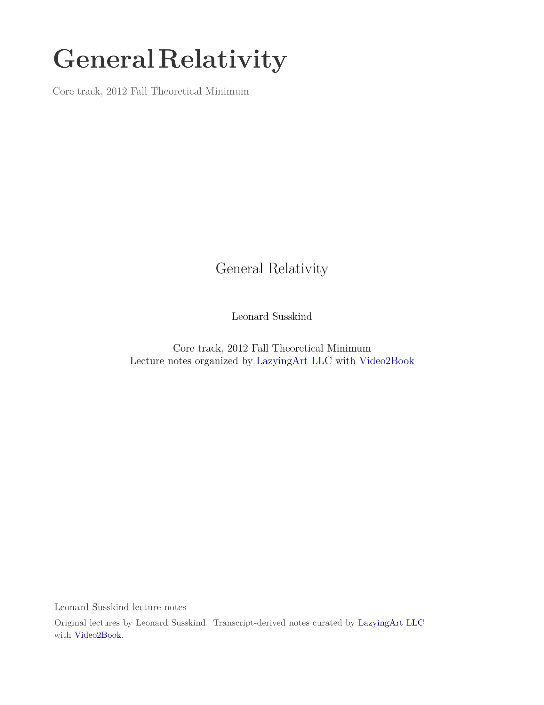</a><br>
      <strong>Relatividad general</strong><br>
      <sub>Otoño de 2012 Theoretical Minimum</sub>
    </td>
    <td align="center">
      <a href="../core_general_relativity/2008_fall_einsteins_general_theory_of_relativity/general_relativity_2008_fall_einsteins_general_theory_of_relativity.pdf">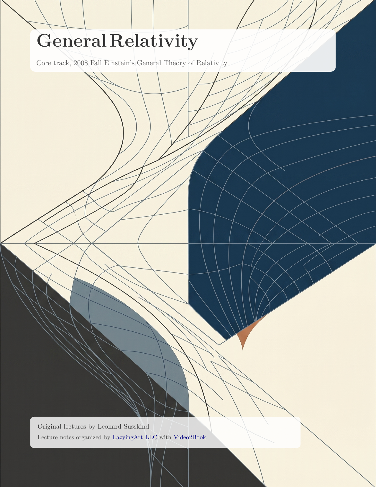</a><br>
      <strong>Relatividad general</strong><br>
      <sub>Otoño de 2008 teoría general de Einstein</sub>
    </td>
    <td align="center">
      <a href="../core_statistical_mechanics/2013_spring_theoretical_minimum/statistical_mechanics_theoretical_minimum.pdf">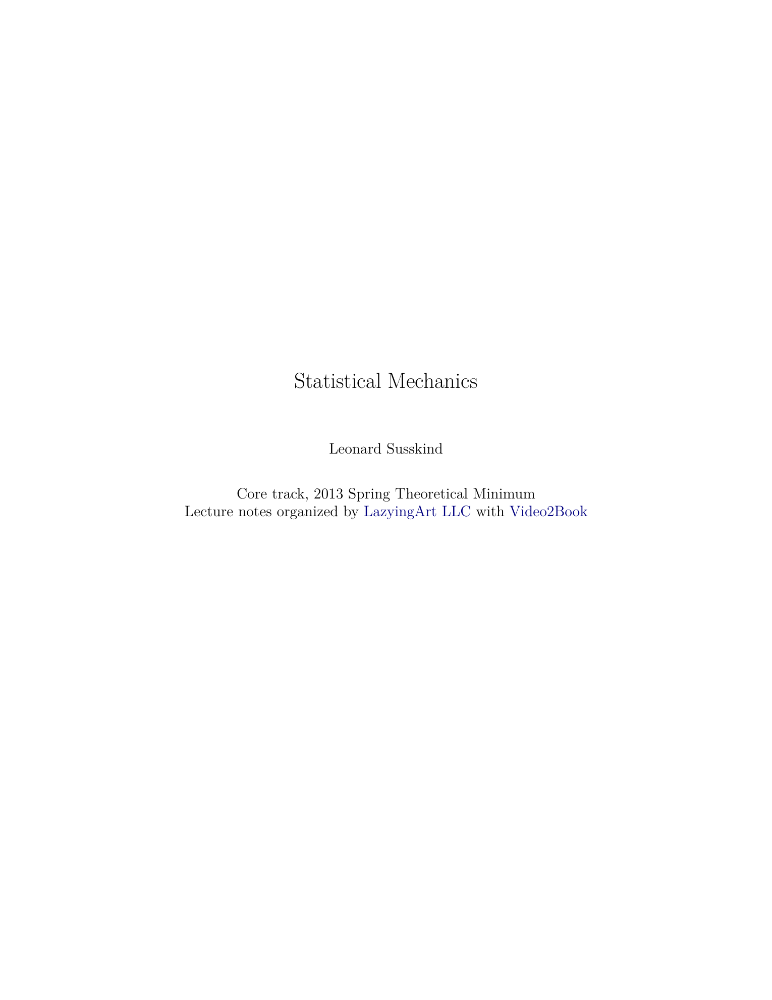</a><br>
      <strong>Mecánica estadística</strong><br>
      <sub>Primavera de 2013 Theoretical Minimum</sub>
    </td>
  </tr>
  <tr>
    <td align="center">
      <a href="../core_cosmology/2013_winter_theoretical_minimum/cosmology_theoretical_minimum.pdf"></a><br>
      <strong>Cosmología</strong><br>
      <sub>Invierno de 2013 Theoretical Minimum</sub>
    </td>
    <td align="center">
      <a href="../core_cosmology/2009_winter_legacy_cosmology/cosmology_legacy.pdf">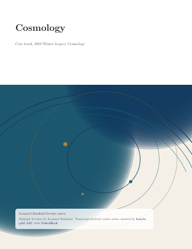</a><br>
      <strong>Cosmología</strong><br>
      <sub>Ejecución heredada de invierno de 2009</sub>
    </td>
    <td></td>
    <td></td>
  </tr>
  <tr>
    <td colspan="4"><strong>Complementario</strong> · Cuántica → Especial → General → Estadística → Cosmología</td>
  </tr>
  <tr>
    <td align="center">
      <a href="../supplemental_advanced_quantum/advanced_quantum_mechanics.pdf">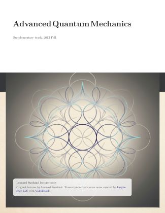</a><br>
      <strong>Mecánica cuántica avanzada</strong><br>
      <sub>Libro complementario del curso</sub>
    </td>
    <td align="center">
      <a href="../supplemental_quantum_entanglement/quantum_entanglement_part_1.pdf">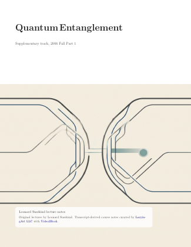</a><br>
      <strong>Entrelazamiento cuántico</strong><br>
      <sub>Parte 1</sub>
    </td>
    <td align="center">
      <a href="../supplemental_quantum_entanglement/quantum_entanglement_part_3.pdf">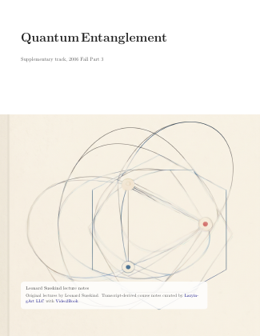</a><br>
      <strong>Entrelazamiento cuántico</strong><br>
      <sub>Parte 3</sub>
    </td>
  </tr>
  <tr>
    <td align="center">
      <a href="../supplemental_particle_physics_1/particle_physics_1_basic_concepts.pdf">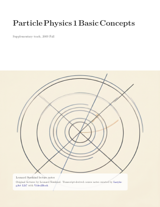</a><br>
      <strong>Física de partículas 1</strong><br>
      <sub>Conceptos básicos</sub>
    </td>
    <td align="center">
      <a href="../supplemental_particle_physics_2/particle_physics_2_standard_model.pdf">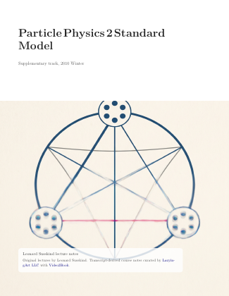</a><br>
      <strong>Física de partículas 2</strong><br>
      <sub>Modelo estándar</sub>
    </td>
    <td align="center">
      <a href="../supplemental_particle_physics_3/particle_physics_3_supersymmetry_and_grand_unification.pdf">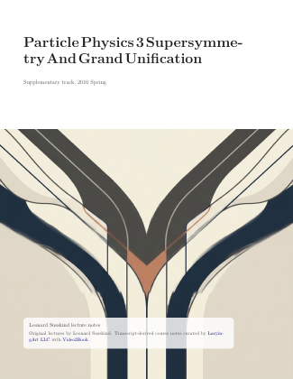</a><br>
      <strong>Física de partículas 3</strong><br>
      <sub>Supersimetría y gran unificación</sub>
    </td>
  </tr>
  <tr>
    <td align="center">
      <a href="../supplemental_cosmology_and_black_holes/topics_in_string_theory.pdf">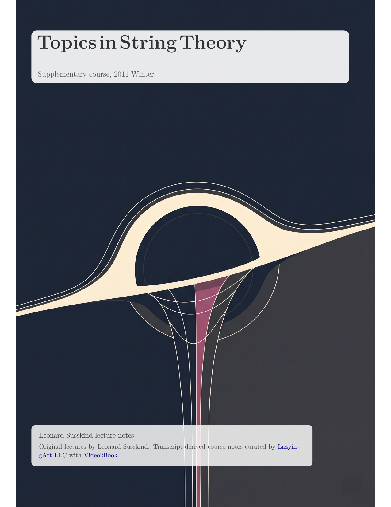</a><br>
      <strong>Temas de teoría de cuerdas</strong><br>
      <sub>Conjunto de cosmología y agujeros negros</sub>
    </td>
    <td align="center">
      <a href="../supplemental_string_theory/string_theory_and_m_theory.pdf">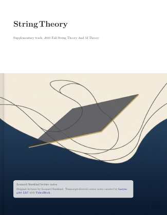</a><br>
      <strong>String Theory and M-Theory</strong><br>
      <sub>Libro complementario del curso</sub>
    </td>
    <td align="center">
      <a href="../supplemental_higgs_boson/demystifying_the_higgs_boson.pdf">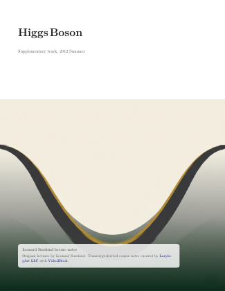</a><br>
      <strong>Desmitificando el bosón de Higgs</strong><br>
      <sub>Libro de una sola conferencia</sub>
    </td>
  </tr>
</table>

## ✨ Lo que ofrece este repositorio

- PDFs de cursos y material LaTeX existentes mantenidos manualmente en las carpetas `core_*` y `supplemental_*`.
- Una capa de transcripción emparejada para el archivo de conferencias:
  - `subtitles/` para `.srt`
  - `markdown/` para transcripciones Markdown con marcas de tiempo
- Un flujo de transcripción a TeX en `generated_course_notes/`.
- El submódulo `Video2Book/` para descarga de listas de reproducción, transcripción y automatización de subtítulos a notas.
- Material complementario importado en `theoretical_minimum_companion_notes/`.
- Plantillas LaTeX reutilizables en `template/kaobook` y `template/tuftle`.

El inglés es el README canónico. Las traducciones viven en `i18n/` y pueden quedar retrasadas respecto al archivo en inglés.

## 🎬 Lista de reproducción fuente

El archivo principal de transcripciones y subtítulos de este repositorio se deriva de esta lista de reproducción de YouTube:

- <https://www.youtube.com/playlist?list=PLERGeJGfknBTR_nXt5QL88xJF5LhDZBnG>

## 🗂️ Estructura del repositorio

<table>
  <colgroup>
    <col style="width: 33%">
    <col style="width: 33%">
    <col style="width: 34%">
  </colgroup>
  <thead>
    <tr>
      <th>📚 Capa</th>
      <th>📍 Ruta principal</th>
      <th>🧾 Qué contiene</th>
    </tr>
  </thead>
  <tbody>
    <tr>
      <td>Carpetas de cursos mantenidas manualmente</td>
      <td><code>core_*</code>, <code>supplemental_*</code></td>
      <td>Carpetas de cursos orientadas al lector, PDFs publicados, READMEs y fuentes LaTeX seleccionadas.</td>
    </tr>
    <tr>
      <td>Subtítulos</td>
      <td><code>subtitles/</code></td>
      <td>Archivos de subtítulos de conferencias en formato <code>.srt</code>.</td>
    </tr>
    <tr>
      <td>Transcripciones Markdown</td>
      <td><code>markdown/</code></td>
      <td>Transcripciones de conferencias con marcas de tiempo usadas para lectura, búsqueda y generación de notas.</td>
    </tr>
    <tr>
      <td>Fuentes de notas generadas</td>
      <td><code>generated_course_notes/</code></td>
      <td>Capítulos TeX derivados de transcripciones, figuras, prompts y material de compilación de cursos.</td>
    </tr>
    <tr>
      <td>PDFs generados publicados</td>
      <td><code>supplemental_*/</code></td>
      <td>Resultados publicados canónicos para cursos generados terminados, usando un nombre de archivo PDF fusionado específico por curso más archivos <code>lecture_XX.pdf</code>.</td>
    </tr>
    <tr>
      <td>Artefactos de compilación heredados</td>
      <td><code>core_cosmology/cosmology_ch10/artifacts/</code></td>
      <td>Resultados de compilación conservados para el subproyecto más antiguo de cosmología del capítulo 10.</td>
    </tr>
    <tr>
      <td>Notas complementarias</td>
      <td><code>theoretical_minimum_companion_notes/</code></td>
      <td>Notas complementarias TeX importadas y derivadas del proyecto <code>weka511/tm</code>.</td>
    </tr>
    <tr>
      <td>Plantillas y material compartido</td>
      <td><code>template/</code>, <code>figs/</code>, <code>the_theoretical_minimum/</code>, <code>Video2Book/</code></td>
      <td>Plantillas LaTeX, branding/recursos compartidos, el checkout del submódulo relacionado y el submódulo de automatización de descarga/transcripción.</td>
    </tr>
  </tbody>
</table>

Dentro de `subtitles/`, `markdown/` y `generated_course_notes/`, el material se organiza por ruta (`core/` o `supplementary`), luego por materia y luego por ejecución del curso.

Para las notas generadas, cada carpeta de curso suele contener:

- `chapters/` para TeX lección por lección y PDFs por lección
- `figures/` para fotogramas extraídos de las conferencias y recursos de figuras
- `course.tex` y `course.pdf` para el libro completo del curso fusionado

## 🧭 Carpetas raíz de cursos

| 🏷️ Grupo | 📂 Carpetas |
|---|---|
| Principal | `core_classical_mechanics`, `core_quantum_mechanics`, `core_special_relativity`, `core_general_relativity`, `core_cosmology`, `core_statistical_mechanics` |
| Complementario | `supplemental_advanced_quantum`, `supplemental_cosmology_and_black_holes`, `supplemental_higgs_boson`, `supplemental_particle_physics_1`, `supplemental_particle_physics_2`, `supplemental_particle_physics_3`, `supplemental_quantum_entanglement`, `supplemental_relativity`, `supplemental_string_theory` |

## 🚀 Cómo usar el repositorio

### 📖 Leer notas publicadas

Abre los PDFs en la carpeta del curso correspondiente, por ejemplo:

- `../core_classical_mechanics/2011_fall_theoretical_minimum/classical_mechanics_theoretical_minimum.pdf`
- `../core_classical_mechanics/2011_fall_modern_physics_stanford_partial/classical_mechanics_stanford_partial.pdf`
- `../core_quantum_mechanics/2012_winter_theoretical_minimum/quantum_mechanics_theoretical_minimum.pdf`
- `../core_quantum_mechanics/2012_winter_modern_physics_stanford/quantum_mechanics_modern_physics_stanford.pdf`
- `../core_special_relativity/2012_spring_theoretical_minimum/special_relativity_theoretical_minimum.pdf`
- `../core_general_relativity/2012_fall_theoretical_minimum/general_relativity_theoretical_minimum.pdf`
- `../core_cosmology/2013_winter_theoretical_minimum/cosmology_theoretical_minimum.pdf`
- `../core_cosmology/2009_winter_legacy_cosmology/cosmology_legacy.pdf`
- `../core_statistical_mechanics/lesson_1.pdf`
- `../supplemental_advanced_quantum/advanced_quantum_mechanics.pdf`
- `../supplemental_cosmology_and_black_holes/topics_in_string_theory.pdf`
- `../supplemental_higgs_boson/demystifying_the_higgs_boson.pdf`
- `../supplemental_particle_physics_1/particle_physics_1_basic_concepts.pdf`
- `../supplemental_particle_physics_2/particle_physics_2_standard_model.pdf`
- `../supplemental_particle_physics_3/particle_physics_3_supersymmetry_and_grand_unification.pdf`
- `../supplemental_quantum_entanglement/quantum_entanglement_part_1.pdf`
- `../supplemental_quantum_entanglement/quantum_entanglement_part_3.pdf`
- `../supplemental_string_theory/string_theory_and_m_theory.pdf`

### 📝 Leer transcripciones directamente

Usa:

- `../subtitles/` para lectura estilo subtítulos y fidelidad de marcas de tiempo
- `../markdown/` para revisión de texto, búsqueda y generación de notas

### ⬇️ Actualizar la lista de reproducción fuente

Usa el contenedor padre, que delega al submódulo `Video2Book`:

```bash
./scripts/download_susskind_playlist.sh
```

### 🎙️ Ejecutar la cola de transcripción

Usa los contenedores padre, que delegan al submódulo `Video2Book`:

```bash
./scripts/start_transcription_tmux.sh
./scripts/start_transcription_monitor_tmux.sh
```

### 🧪 Trabajar en notas derivadas de transcripciones

El espacio de trabajo de notas generadas vive en:

- `../generated_course_notes/`

Dentro de cada ejecución del curso:

- `chapters/` contiene una carpeta por lección
- cada carpeta de lección contiene el capítulo TeX y su PDF compilado
- `course.pdf` es el PDF completo fusionado del curso para esa ejecución

Ejecuta el curador de notas mediante los contenedores padre, que delegan al submódulo `Video2Book`:

```bash
./scripts/start_course_notes_tmux.sh
./scripts/start_course_notes_monitor_tmux.sh
```

### 📘 Exportar PDFs compactos en formato de bolsillo

Genera variantes portátiles de 6x9 pulgadas a partir de LaTeX de cursos generados terminados:

```bash
./scripts/export_course_pocket_pdfs.sh
./scripts/export_course_pocket_pdfs.sh --size a5 --suffix a5
```

Las salidas se escriben por defecto en `../all_notes/pocket_books/<course>_pocket.pdf` (nombres de archivo
canónicos, con sufijo personalizado opcional mediante `--suffix`).

### 📚 Trabajar en notas complementarias importadas

```bash
./theoretical_minimum_companion_notes/build_all.sh
```

## 🤝 Colaboración

Las contribuciones que mejoren la calidad matemática, la claridad y la preservación del material de estudio relacionado con Leonard Susskind son bienvenidas.

Las áreas prioritarias incluyen:

- limpieza de transcripciones
  - corregir atribución de hablantes
  - reparar marcas de tiempo
  - corregir términos de física, nombres y notación
- mejora de TeX
  - convertir transcripciones en una exposición matemática más limpia
  - mejorar estructura, tipografía y referencias cruzadas
  - refinar capítulos generados hasta convertirlos en apuntes de curso duraderos
- trabajo en figuras y ecuaciones
  - verificar fotogramas extraídos de las conferencias
  - redibujar diagramas en TikZ
  - convertir ecuaciones de pizarra a LaTeX fiable
- trabajo archivístico de física más amplio
  - mejorar el material complementario de *Theoretical Minimum*
  - conectar conferencias, libros y conjuntos de apuntes relacionados de Susskind
  - ayudar a difundir y preservar responsablemente este cuerpo de enseñanza de la física

Las contribuciones deben usar commits enfocados e identificar exactamente las carpetas, transcripciones o ejecuciones de curso modificadas.

## 🙏 Agradecimientos

- Leonard Susskind por el contenido original de las conferencias.
- Curación del repositorio y herramientas de publicación: [LazyingArt LLC](https://lazying.art)
- Simon Crase por el repositorio de notas complementarias importado en `../theoretical_minimum_companion_notes/`.
- Repositorio fuente de las notas complementarias: <https://github.com/weka511/tm>
- Fuentes de notas referenciadas existentes:
  - <https://www.lapasserelle.com/general_relativity/>
  - <https://www.lapasserelle.com/cosmology/>
  - <https://www.lapasserelle.com/statistical_mechanics/>
- Nota de procedencia para los conjuntos PDF más antiguos derivados de La Passerelle:
  - [`../references/lapasserelle_susskind_pdf_provenance.md`](../references/lapasserelle_susskind_pdf_provenance.md)

## ❤️ Apoyo

| Donate | PayPal | Stripe |
| --- | --- | --- |
| [](https://chat.lazying.art/donate) | [](https://paypal.me/RongzhouChen) | [](https://buy.stripe.com/aFadR8gIaflgfQV6T4fw400) |

## Licencia

Este repositorio está licenciado bajo la GNU General Public License v3.0. Consulta [LICENSE](../LICENSE).
